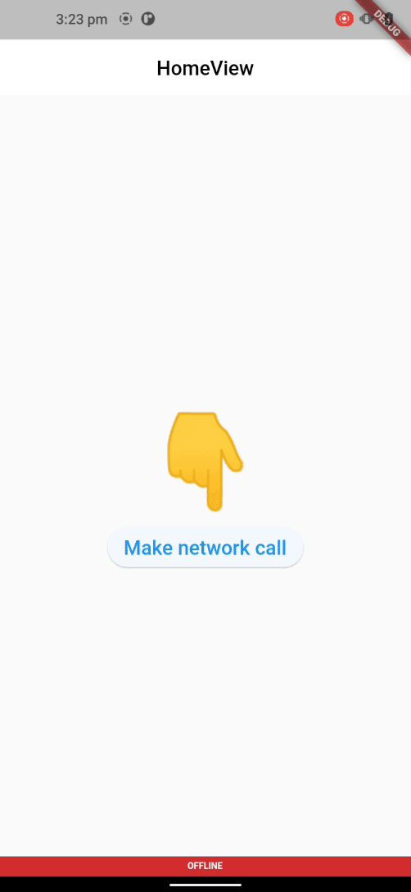

<!-- 
This README describes the package. If you publish this package to pub.dev,
this README's contents appear on the landing page for your package.

For information about how to write a good package README, see the guide for
[writing package pages](https://dart.dev/guides/libraries/writing-package-pages). 

For general information about developing packages, see the Dart guide for
[creating packages](https://dart.dev/guides/libraries/create-library-packages)
and the Flutter guide for
[developing packages and plugins](https://flutter.dev/developing-packages). 
-->
# Avio

Avio is working towards making api calls as easy as possible for developers

## Features

### Make API calls and show connectivity status anf handle loading overlay with ease




## TODO

[x] Handle REST-API calls  
[x] Satus widgets  
[]  Intigrate alice package for debugging  
[]  Handle GraphQL calls  
[]  Handle Socket calls  
[]  Handle gRPC calls

## Usage

To use this package, First you need to initailize this Avio.init() preferably in main(). And if you need to add any Dio interceptors, you can add them like this.

```dart
void main() async {
  WidgetsFlutterBinding.ensureInitialized();
  Avio.init();
  AvioInterceptors.interceptors = [
    RetryInterceptor(
      dio: AvioInterceptors.dio!,
      logPrint: print, // specify log function (optional)
      retries: 3, // retry count (optional)
    )
  ];
  runApp(
    Root(),
  );
}
```

Package also provides a widget to show a loading overlay from anywhere in your code and it also shows a banner for internet connectivity.  
Here you can style your connectivity message banner and loading overlay

```dart
//recommended use of widget
MaterialApp(
      title: "Application",
      ...
      builder: (context, child) {
        return AvioWrapper(child: child!);
      },
    );
```

```dart
//To check internet status
CLStatus.instance.isConnected().value //returns bool

//To check or enable or disable loading overlay
CLStatus.instance.isLoading.value //returns bool
```

```dart
//To make REST-API calls
ApiCall.instance.rest(
    params: {},
    serviceUrl: URL,
    showLoader: true,
    methodType: RestMethod.get, 
    //supported Methods [GET,POST,PUT,DLETE,PATCH]
    success: (statusCode,data) {
        print(data);
    },
    error: (statusCode, error){},
    invalidResponse: (statusCode, error) {},
);
```

## Additional information

This package is developed and maintained by [AveoSoft Pvt Ltd](https://aveosoft.com/).
For any issues & improvements you can create an issue in Github Issues.
